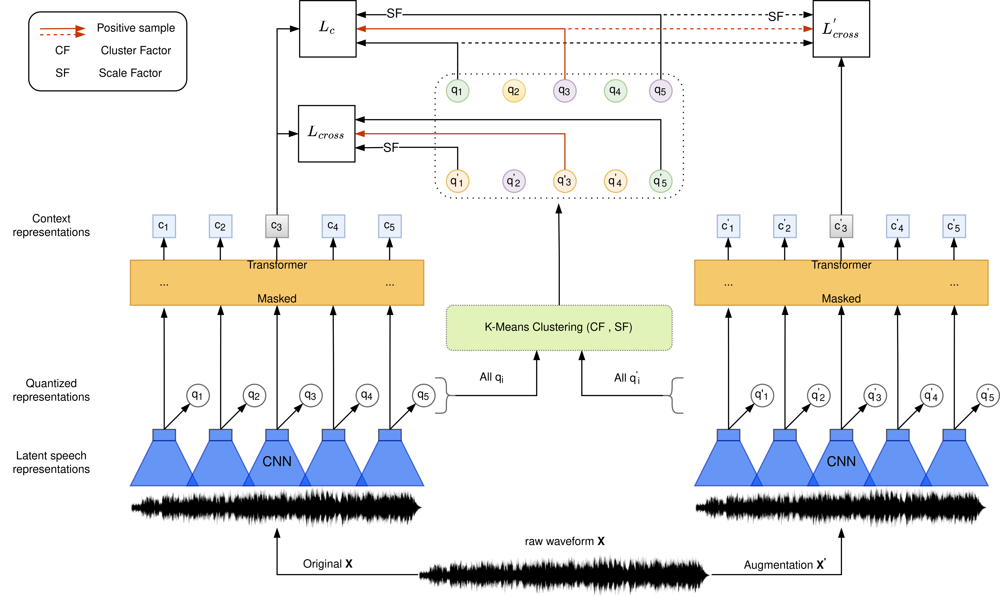

# [ccc-wav2vec 2.0](https://arxiv.org/abs/2210.02592)

Paper Title: CCC-wav2vec 2.0: Clustering aided Cross Contrastive Self-Supervised Learning of Speech Representations. To Appear at IEEE SLT 2022 ([arxiv link](https://arxiv.org/abs/2210.02592)).

ccc-wav2vec 2.0 is a pre-training mechanism which uses clustering and an augmentation-based cross-contrastive loss as its self-supervised objective. Through the clustering module, we scale down the influence of those negative examples that are highly similar to the positive. The Cross-Contrastive loss is computed between the encoder output of the original sample and the quantizer output of its augmentation and vice-versa, bringing robustness to the pre-training strategy.

<p align="center">
  
</p>

Primary Contributions:
* We introduce an augmentation of the original sample and use its representations to add an auxiliary Cross-Contrastive loss to the existing contrastive loss in wav2vec 2.0.
* We demonstrate the usefulness of a clustering module to segregate the negative examples and thereby control the effect of the weak non-informative negative examples in the contrastive learning task.
* Combining the above two modules leads to the development of ccc-wav2vec 2.0, a robust pre-training approach that consistently outperforms wav2vec 2.0 in tasks such as ASR, Domain Adaptation, and zero-shot decoding.

## Models
Will be made available soon...

* Pre-training and fine-tuning procedures can be found [here](https://github.com/Speech-Lab-IITM/CCC-wav2vec-2.0/examples/wav2vec).

## Requirements and Installation

* [PyTorch](https://pytorch.org/) version >= 1.10.0
* Python version >= 3.8
* For training new models, you'll also need an NVIDIA GPU and NCCL
* To install fairseq with ccc-wav2vec 2.0 and develop locally:

``` bash
git clone https://github.com/Speech-Lab-IITM/CCC-wav2vec-2.0
cd fairseq
pip install --editable ./
```

* **For faster training** install NVIDIA's [apex](https://github.com/NVIDIA/apex) library:

``` bash
git clone https://github.com/NVIDIA/apex
cd apex
pip install -v --no-cache-dir --global-option="--cpp_ext" --global-option="--cuda_ext" \
  --global-option="--deprecated_fused_adam" --global-option="--xentropy" \
  --global-option="--fast_multihead_attn" ./
```

* **For large datasets** install [PyArrow](https://arrow.apache.org/docs/python/install.html#using-pip): `pip install pyarrow`
* If you use Docker make sure to increase the shared memory size either with `--ipc=host` or `--shm-size`
 as command line options to `nvidia-docker run` .

* **For Augmentations** to work install [torchaudio-augmentations](https://github.com/Speech-Lab-IITM/torchaudio-augmentations): 
```bash
git clone https://github.com/Speech-Lab-IITM/torchaudio-augmentations
cd torchaudio-augmentations
pip install --editable ./
```

* The clustering module functions on GPU needs **fast-pytorch-kmeans** to be installed: `pip install fast-pytorch-kmeans`

## Parameters of interest

* The $\alpha$, $\beta$ and $\gamma$ values from the paper can be caliberated from the `cc_weights` parameter in the `criterion` section of the pre-training configs which can be found from the [pre-training config](https://github.com/Speech-Lab-IITM/CCC-wav2vec-2.0/examples/wav2vec/config/pretraining).
* The `cluster_factor` and `scale_factor` parameters can be modified from the `model` section of the pre-training configs which can be found from the [pre-training config](https://github.com/Speech-Lab-IITM/CCC-wav2vec-2.0/examples/wav2vec/config/pretraining).
* The augmentations used for ccc-wav2vec 2.0 requires the noise set of MUSAN dataset. The path to the same is to be specified in the `path_to_musan_noise_set` variable of the __getitem__ method of the [raw_audio_dataset](https://github.com/Speech-Lab-IITM/CCC-wav2vec-2.0/fairseq/data/audio/raw_audio_dataset.py) file.

## Reference Code
1. Facebook AI Research Sequence-to-Sequence Toolkit written in Python. [fairseq](https://github.com/facebookresearch/fairseq)